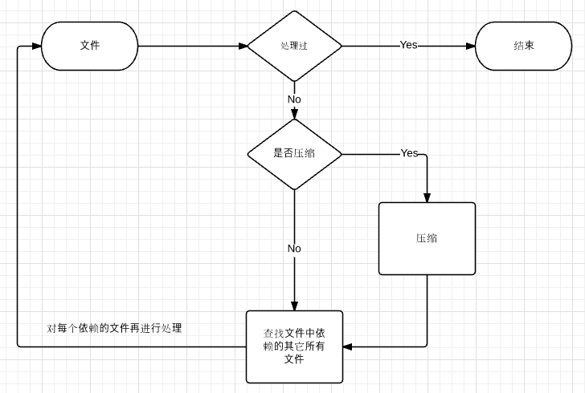
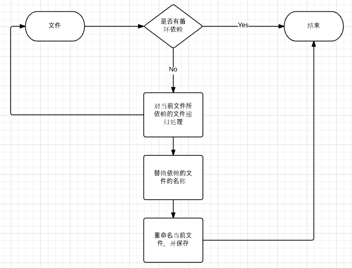
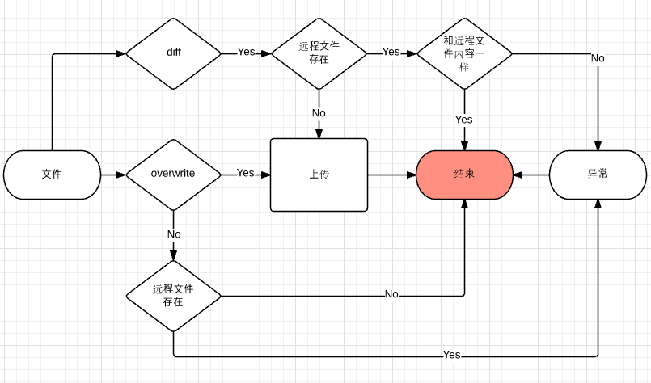

## deploy-asset 执行流程

> 阅读此文之前，可以先了解[《deploy-asset 项目背景》](./Background.md)


da 的执行流程可以按顺序分成下面四个步骤：

1. [init](#init) — 初始化整个项目，包括配置文件的验证、获取需要操作的所有文件以及创建指定的 Uploader
2. [inspect](#inspect) — 查找文件依赖关系，如果指定了压缩，同时也会对文件压缩
3. [replace](#replace) — 对文件进行重命名，并更新文件中其它静态资源的文件名称
4. [upload](#upload) — 上传文件

 
### init

```
-> 验证配置
-> 根据配置确定所有需要处理的文件
-> 确定要上传的文件的根目录（根目录决定了上传后的文件的路径）
-> 保证所有要处理的文件都在根目录内
-> 应用 `includePatterns` 和 `noIncludePatterns` 对要操作的文件进行过滤，得到最终的要处理的文件
-> 创建 Uploader
```


[源代码](../src/steps/step-init.js)


### inspect



[源代码](../src/steps/step-inspect.js)

### replace



[源代码](../src/steps/step-replace.js)

### upload



[源代码](../src/steps/step-upload.js)


### 继续阅读

- [《使用 deploy-asset 的 CLI》](./Use_CLI.md)
- [《使用 deploy-asset 的 API》](./Use_API.md)
